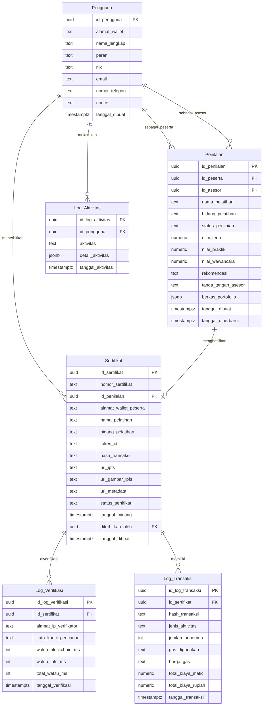

# ERD Final Sistem Sertifikat Digital Pelatihan

## Deskripsi Umum

Entity Relationship Diagram (ERD) final ini menggambarkan rancangan basis data untuk **Sistem Sertifikat Digital Pelatihan** dengan fokus pada penerbitan dan verifikasi sertifikat pelatihan keahlian profesional bidang pengembangan web berbasis **Soulbound Token** pada jaringan **Polygon Amoy**.

Rancangan basis data ini menggunakan satu pelatihan tetap, yaitu:

- **Nama pelatihan**: Junior Web Developer
- **Bidang pelatihan**: Pengembangan Web

ERD final terdiri atas enam entitas utama, yaitu:

1. Pengguna
2. Penilaian
3. Sertifikat
4. Log Verifikasi
5. Log Aktivitas
6. Log Transaksi

---

## 1. Entitas Pengguna

Entitas **Pengguna** menyimpan data seluruh pengguna sistem yang terlibat dalam proses penerbitan dan verifikasi sertifikat digital.

### Atribut Pengguna

| Nama Atribut | Tipe Data | Keterangan |
|---|---|---|
| id_pengguna | uuid | Kunci Utama |
| alamat_wallet | text | Alamat wallet blockchain pengguna |
| nama_lengkap | text | Nama lengkap pengguna |
| peran | text | Peran pengguna dalam sistem |
| nik | text | Nomor Induk Kependudukan |
| email | text | Alamat email pengguna |
| nomor_telepon | text | Nomor telepon pengguna |
| nonce | text | Nilai acak untuk proses autentikasi tanda tangan digital |
| tanggal_dibuat | timestamptz | Waktu pembuatan data pengguna |

### Nilai Peran

Nilai peran pada entitas Pengguna terdiri atas:

- **Admin**
- **Asesor**
- **Peserta**

---

## 2. Entitas Penilaian

Entitas **Penilaian** menyimpan data hasil penilaian peserta pelatihan oleh asesor. Data ini menjadi dasar kelulusan peserta sebelum sertifikat digital diterbitkan.

### Atribut Penilaian

| Nama Atribut | Tipe Data | Keterangan |
|---|---|---|
| id_penilaian | uuid | Kunci Utama |
| id_peserta | uuid | Kunci Tamu ke Pengguna |
| id_asesor | uuid | Kunci Tamu ke Pengguna |
| nama_pelatihan | text | Nama pelatihan |
| bidang_pelatihan | text | Bidang pelatihan |
| status_penilaian | text | Status proses penilaian |
| nilai_teori | numeric | Nilai aspek teori |
| nilai_praktik | numeric | Nilai aspek praktik |
| nilai_wawancara | numeric | Nilai aspek wawancara |
| rekomendasi | text | Rekomendasi hasil penilaian |
| tanda_tangan_asesor | text | Tanda tangan digital asesor |
| berkas_portofolio | jsonb | Data berkas portofolio peserta |
| tanggal_dibuat | timestamptz | Waktu pembuatan data penilaian |
| tanggal_diperbarui | timestamptz | Waktu terakhir pembaruan data penilaian |

### Nilai Tetap Penilaian

- **nama_pelatihan = Junior Web Developer**
- **bidang_pelatihan = Pengembangan Web**

---

## 3. Entitas Sertifikat

Entitas **Sertifikat** menyimpan data sertifikat digital yang diterbitkan setelah peserta dinyatakan memenuhi hasil penilaian. Sertifikat ini terhubung dengan data blockchain dan metadata penyimpanan terdistribusi.

### Atribut Sertifikat

| Nama Atribut | Tipe Data | Keterangan |
|---|---|---|
| id_sertifikat | uuid | Kunci Utama |
| nomor_sertifikat | text | Nomor unik sertifikat |
| id_penilaian | uuid | Kunci Tamu ke Penilaian |
| alamat_wallet_peserta | text | Alamat wallet milik peserta |
| nama_pelatihan | text | Nama pelatihan |
| bidang_pelatihan | text | Bidang pelatihan |
| token_id | text | Identitas token pada blockchain |
| hash_transaksi | text | Hash transaksi blockchain |
| uri_ipfs | text | URI dokumen atau aset pada IPFS |
| uri_gambar_ipfs | text | URI gambar sertifikat pada IPFS |
| uri_metadata | text | URI metadata sertifikat |
| status_sertifikat | text | Status sertifikat digital |
| tanggal_minting | timestamptz | Waktu penerbitan token sertifikat |
| diterbitkan_oleh | uuid | Kunci Tamu ke Pengguna |
| tanggal_dibuat | timestamptz | Waktu pembuatan data sertifikat |

### Nilai Tetap Sertifikat

- **nama_pelatihan = Junior Web Developer**
- **bidang_pelatihan = Pengembangan Web**

---

## 4. Entitas Log Verifikasi

Entitas **Log Verifikasi** menyimpan catatan proses verifikasi publik terhadap sertifikat digital. Data ini digunakan untuk memantau performa verifikasi serta riwayat pencarian sertifikat.

### Atribut Log Verifikasi

| Nama Atribut | Tipe Data | Keterangan |
|---|---|---|
| id_log_verifikasi | uuid | Kunci Utama |
| id_sertifikat | uuid | Kunci Tamu ke Sertifikat |
| alamat_ip_verifikator | text | Alamat IP pihak yang melakukan verifikasi |
| kata_kunci_pencarian | text | Kata kunci atau nomor yang dipakai dalam verifikasi |
| waktu_blockchain_ms | int | Waktu pembacaan data blockchain dalam milidetik |
| waktu_ipfs_ms | int | Waktu pembacaan metadata IPFS dalam milidetik |
| total_waktu_ms | int | Total waktu proses verifikasi dalam milidetik |
| tanggal_verifikasi | timestamptz | Waktu terjadinya proses verifikasi |

---

## 5. Entitas Log Aktivitas

Entitas **Log Aktivitas** menyimpan catatan aktivitas pengguna dalam sistem. Log ini digunakan untuk keperluan pelacakan tindakan, audit operasional, dan riwayat penggunaan sistem.

### Atribut Log Aktivitas

| Nama Atribut | Tipe Data | Keterangan |
|---|---|---|
| id_log_aktivitas | uuid | Kunci Utama |
| id_pengguna | uuid | Kunci Tamu ke Pengguna |
| aktivitas | text | Jenis aktivitas yang dilakukan |
| detail_aktivitas | jsonb | Informasi tambahan terkait aktivitas |
| tanggal_aktivitas | timestamptz | Waktu aktivitas dilakukan |

---

## 6. Entitas Log Transaksi

Entitas **Log Transaksi** menyimpan catatan transaksi blockchain yang berkaitan dengan penerbitan sertifikat digital. Data ini membantu analisis biaya, jumlah penerima, dan rincian transaksi di jaringan Polygon Amoy.

### Atribut Log Transaksi

| Nama Atribut | Tipe Data | Keterangan |
|---|---|---|
| id_log_transaksi | uuid | Kunci Utama |
| id_sertifikat | uuid | Kunci Tamu ke Sertifikat |
| hash_transaksi | text | Hash transaksi blockchain |
| jenis_aktivitas | text | Jenis aktivitas transaksi |
| jumlah_penerima | int | Jumlah penerima dalam transaksi |
| gas_digunakan | text | Nilai gas yang digunakan |
| harga_gas | text | Harga gas transaksi |
| total_biaya_matic | numeric | Total biaya transaksi dalam MATIC |
| total_biaya_rupiah | numeric | Total biaya transaksi dalam Rupiah |
| tanggal_transaksi | timestamptz | Waktu transaksi dicatat |

---

## Relasi Antar Entitas

Relasi antar entitas pada ERD final ini adalah sebagai berikut:

1. **Pengguna sebagai Peserta memiliki banyak Penilaian.**
2. **Pengguna sebagai Asesor melakukan banyak Penilaian.**
3. **Pengguna sebagai Admin menerbitkan banyak Sertifikat.**
4. **Penilaian menghasilkan nol atau satu Sertifikat.**
5. **Sertifikat memiliki banyak Log Verifikasi.**
6. **Pengguna memiliki banyak Log Aktivitas.**
7. **Sertifikat memiliki banyak Log Transaksi.**

---

## Kardinalitas Relasi

Kardinalitas antar entitas dijelaskan sebagai berikut:

1. **Pengguna 1 ke banyak Penilaian sebagai Peserta.**
2. **Pengguna 1 ke banyak Penilaian sebagai Asesor.**
3. **Pengguna 1 ke banyak Sertifikat sebagai Admin penerbit.**
4. **Penilaian 1 ke 0 atau 1 Sertifikat.**
5. **Sertifikat 1 ke banyak Log Verifikasi.**
6. **Pengguna 1 ke banyak Log Aktivitas.**
7. **Sertifikat 1 ke banyak Log Transaksi.**

---

## Mermaid ERD

---

## Narasi untuk Bab 4

ERD pada Gambar 4.x menggambarkan rancangan basis data sistem penerbitan dan verifikasi sertifikat pelatihan Junior Web Developer. Entity utama terdiri atas Pengguna, Penilaian, Sertifikat, Log Verifikasi, Log Aktivitas, dan Log Transaksi.

Entity Pengguna digunakan untuk menyimpan data pengguna berdasarkan peran Admin, Asesor, dan Peserta. Entity Penilaian digunakan untuk menyimpan hasil penilaian peserta oleh asesor. Entity Sertifikat digunakan untuk menyimpan data sertifikat digital yang diterbitkan, seperti nomor sertifikat, alamat wallet peserta, token ID, hash transaksi, URI IPFS, dan URI metadata.

Entity Log Verifikasi digunakan untuk mencatat proses verifikasi publik, termasuk waktu pembacaan data blockchain, waktu pembacaan metadata IPFS, dan total waktu verifikasi. Entity Log Aktivitas digunakan untuk mencatat aktivitas pengguna dalam sistem, sedangkan Entity Log Transaksi digunakan untuk mencatat data transaksi blockchain pada proses penerbitan sertifikat.

---

## Catatan Akademik

Rancangan ini menunjukkan bahwa sistem telah disederhanakan menjadi satu pelatihan tetap, sehingga struktur basis data menjadi lebih fokus, lebih konsisten, dan lebih sesuai untuk kebutuhan penelitian penerbitan serta verifikasi sertifikat digital pelatihan **Junior Web Developer** pada bidang **Pengembangan Web**.
